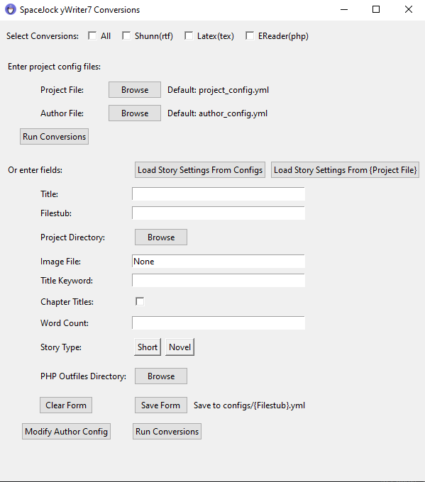
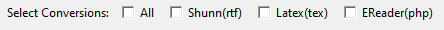
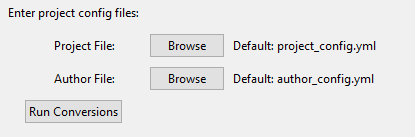
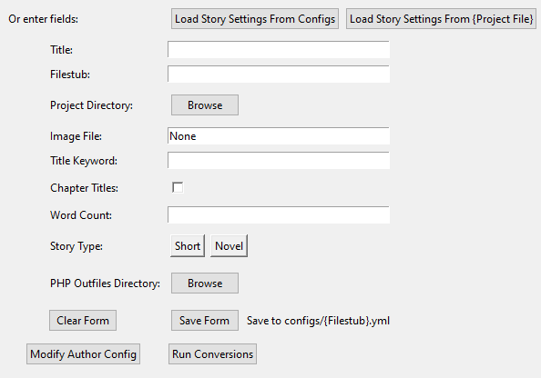
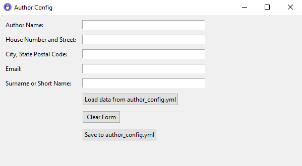

# spacejock_conversions
Converts output html files into php, latex, and rtf outputs. 

These scripts take the html file produced by SpaceJock's yWriter7 output html file and converts it to several formats of my preference and needs. 

## Dependencies 

SpaceJock's story writing software:
http://www.spacejock.com/yWriter.html

### Python Script Dependencies
These will probably be necessary for running these scripts.

* sys
* os
* yaml
* time
* shutil
* pylatex (only latex conversions)
* argparse
* pyinstaller
* tkinter
* subprocess

### Latex Script Dependencies ###
This process produces a tex file and copies over dependencies to the project directory. The resulting tex file will need to be converted using a latex compiler. This file assumes you have installed the following libraries:
* fontenc
* inputenc
* lmodern
* textcomp
* lastpage
* xcolor
* soul

### Rish Text Format (rtf) suggestions
To ensure maximum compatibility, I suggest to open the resulting file in Microsoft Word and select File>Info>Compatibility so that it works across all Microsoft Word office programs

### PHP Dependencies
In order to read the php files, you will need some sort of php compiler. I have only tested this on Apache, but I assume others will work fine.

In order to make the reader more dyslexic friendly, you may need to install the font OpenDyslexic, available for free https://opendyslexic.org/.

## Installation (Windows only)

The executable created to run the program has only been tested on a windows machine. The executable only works if it is kept in the project directory, but this project directory may be saved anywhere on the machine. You can run the program by clicking on the executable from the File Explorer. 

For ease of access to the executable on a Windows machine, you may run the batch script file

```
	create_start_shortcut.bat
```

to create a shortcut to the exectable that appears in your start menu as a program. Note that if you move the project directory to a different location, you will have to rerun the script in order to update the shortcut link.

## Usage

### Setup
Before you run, you will need to set up two config files. One for authorship and one with the project details.

Example author config file:
```
author: "Sarah Skinner"
street_address: "1492 Nunyabiznis Ave"
postal_code: "Pittsburgh, PA 15217"
email: "sssm8d@gmail.com"
author_surname: "Skinner"
```

Example project config file:
```
title: Lorem Ipsum
file_stub: Lorem
project_directory: example\
image_filename: pexels-ann-zzz-8452844.jpg
title_keyword: Lorem
chapter_titles: None
word_count: "1,000"
book_type: "short"
outfile_directory: example\
```

If none are specified the local config files will be ran (they are preset with this example). 

## Running

### Starting the GUI

#### Windows:

Click or activate the ececutable 

```
SpaceJock Conversions.exe
```

#### Any:

Run the command:

```
python run_gui.py
```

in the head folder of the program.

### Using the GUI

The executable activates the tkinter GUI:



#### Section 1:



Checking one or more of these boxes determines the conversions ran. If "all" is checked, then all conversions are ran when the "Run Conversions" button is pressed. If none are checked, no conversions are ran when the "Run Conversions" button is pressed. 

The conversions are saved in the "Project Directory" in the form or after "project_directory" in the config file.

#### Section 2:



This section is where the config files can be set. The config files are defaulted to "project_config.yml" and "author_config.yml" corresponding to the project config and author config files described in the Usage/Setup section. By clicking the "Browse", user defined files can be selected. By clicking the the "Run Conversions" button, the project defined in either the local "project_config.yml" and "author_config.yml" or the user defined files will be used to define the conversions.

#### Section 3:



This section is an alternative method to set the config files. This is a simple editor that enables the user to set all the required project settings for any conversion. 

If the "Load Story Settings From Configs" button is pressed, the user may choose the config file to be loaded into the form.

If the "Load Story Settings From {Project File}" button is selected, the config settings from the file established for "Project File:" entry will be loaded into the form.

The button "Clear Form" will clear the form. 

The "Save Form" will save the file to "configs/{File Stub}.yml" where {File Stub} is established in the "File Stub:" entry.

The "Run Conversions" button in this section will use the present configuration in the form as well as the author config established in the "Author Config:" entry.

The "Modify Author Config" will open a new pop up with a the Author Config form described below.

#### Author Window:



The author gui enables the user to edit the information and save all the required variables for an author config file.

"Load data from {author_config.yml}" button will load the information from the author config file as prescribed in the original gui window in the entry "Author Config:". 

"Clear Form" button will clear the entries in the form.

"Save to {author_config.yml}" button will save the entry data to the give file {author_config.yml}.

### Running from Command Line

For non-Windows users, you 


the main program can run the three different conversions and the arguments are described here:
```
usage: run_conversion.py [-h] [-a AUTHOR] [-p PROJECT] [--shunn] [--tex] [--php] [--all] [-c]

Define conversion types to run.

optional arguments:
  -h, --help            show this help message and exit
  -a AUTHOR, --author AUTHOR
                        path to author config file
  -p PROJECT, --project PROJECT
                        path to project config file
  --shunn               converts given project into a shunn formatted rtf document
  --tex                 converts given project into a latex document
  --php                 converts given project into a set of php reader files
  --all                 runs all conversions
  -c, --clean           deletes all files produced by this program for this project
```

#### html to rtf
The rtf file produced is in the shunn manuscript format required for submission to most publishers with a few personal touches. Requires a rtf reader such as Word. Not compatible with all versions of word, though you may use Microsoft Word to convert it into a compatable version.

Example run:
```
	python spacejock_html_to_shunn.py
```
or 
```
	python run_conversions.py --shunn
```

#### html to latex

Creates a latex file that when compiled to a PDF is a nice printable document with a bookish feel. Requires a latex compiler.

Example run:
```
	python spacejock_html_to_latex.py
```
or 
```
	python run_conversions.py --tex
```
#### html to php

Creates a php E-reader that has Dyslexic friendly font options. Rquires php software to read.

Example run:
```
	python spacejock_html_to_php.py
```
or 
```
	python run_conversions.py --php
```